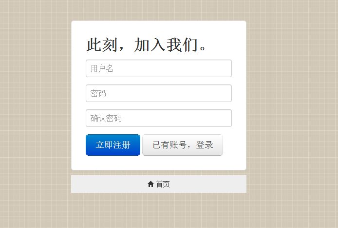
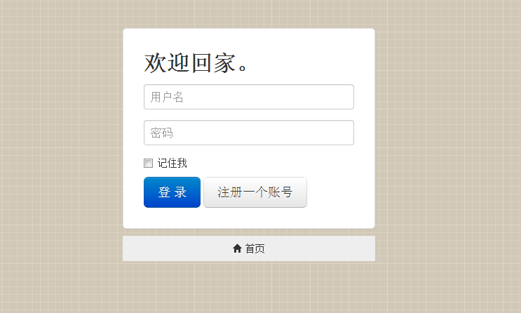
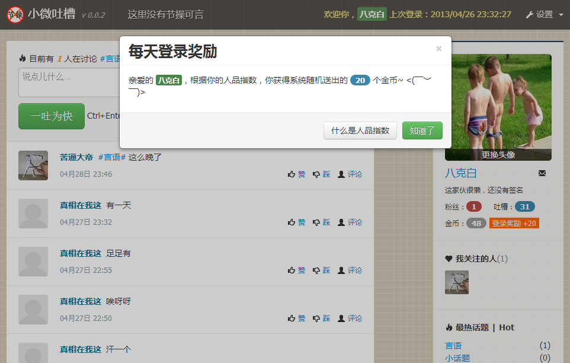
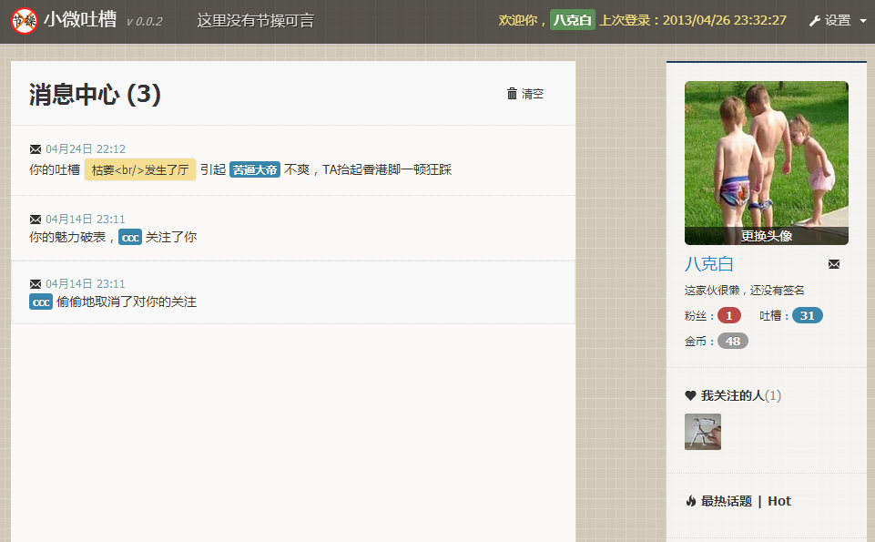
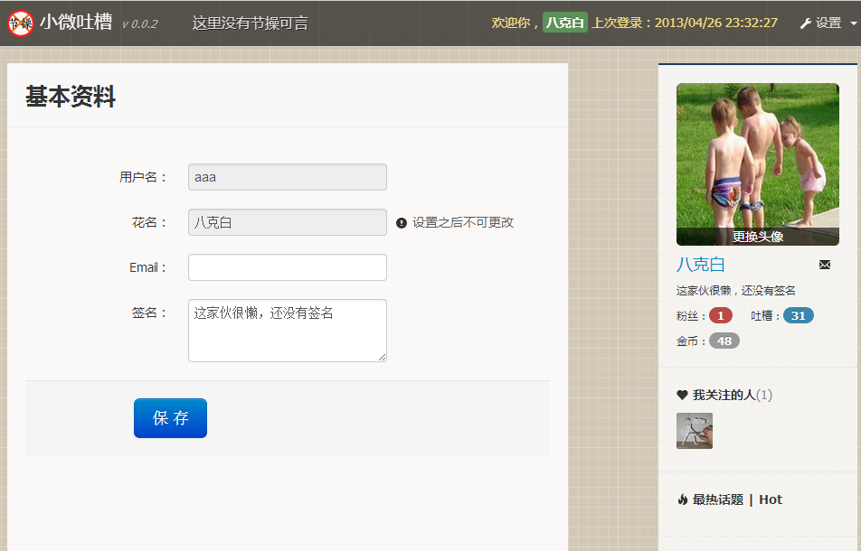
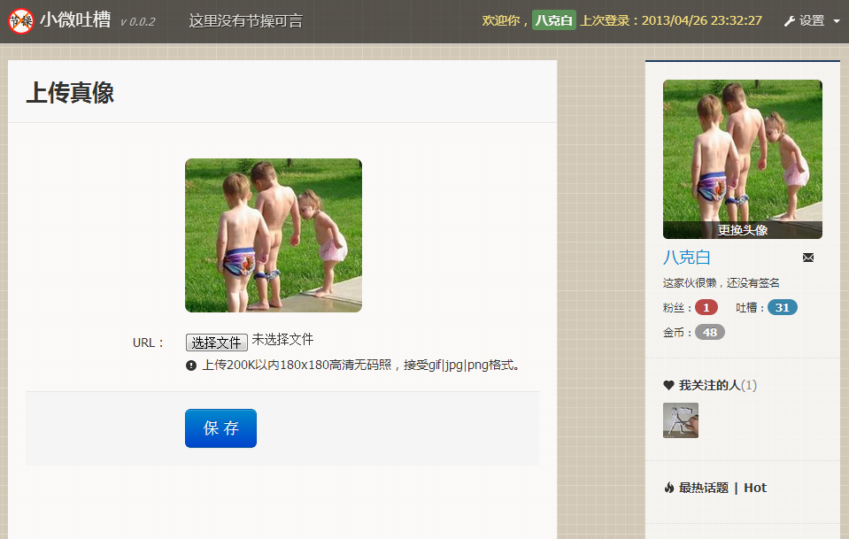
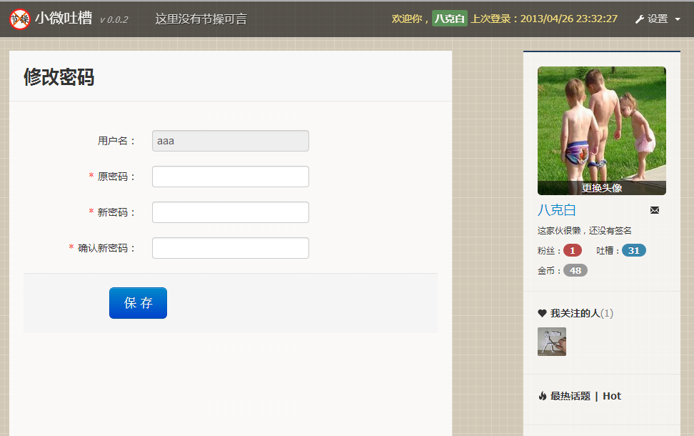
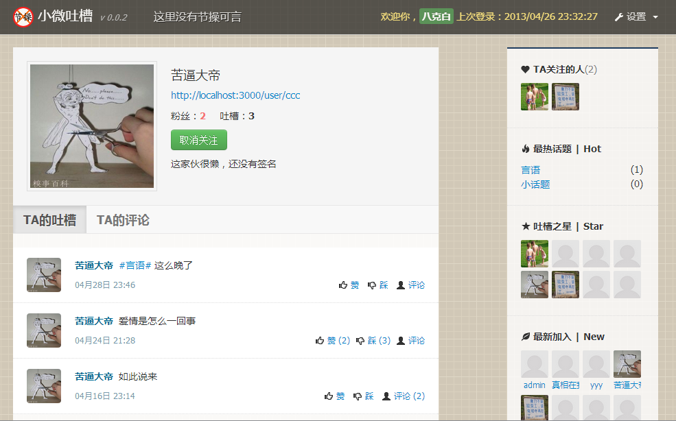
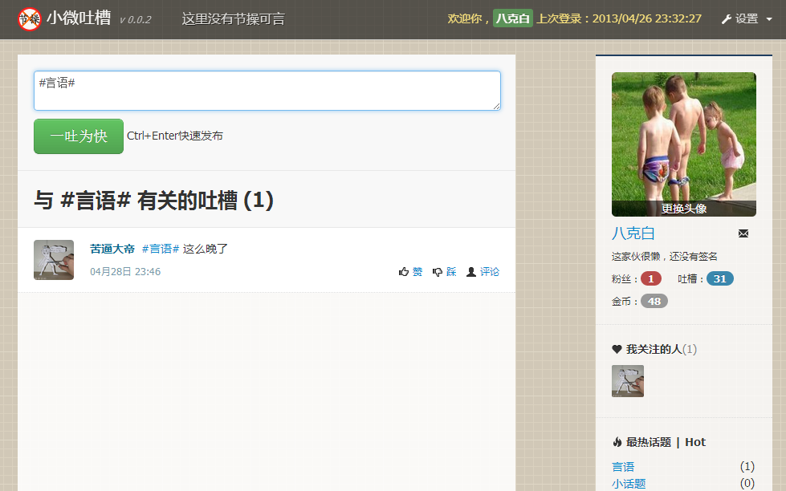
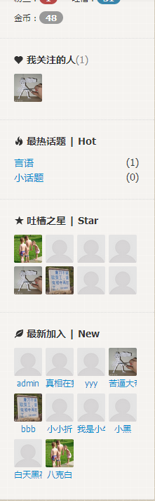

#N-MicroBlog
轻量的多用户微博系统

前端基于 [duckJS](https://github.com/superRaytin/duckJS) + [bootstrap](http://twitter.github.io/bootstrap/)
服务端基于 [NodeJS](http://nodejs.org) + Express + MongoDB

---

简略界面图：

首页：

注册页：

登录页：

登录奖励：

消息中心：

设置 - 基本资料：

设置 - 修改头像

设置 - 修改密码：

查看其他用户页：

话题讨论：

侧栏：

